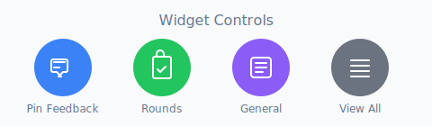
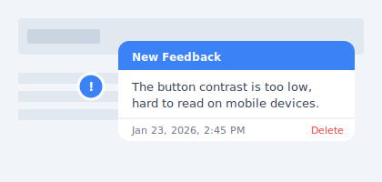
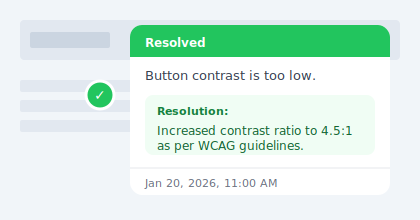
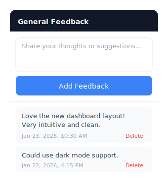
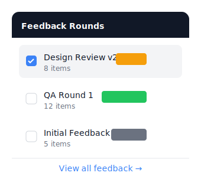

# Point Feedback

A beautiful, zero-dependency visual feedback widget for Next.js applications. Let users click anywhere on your page to drop feedback pins with comments.

## Screenshots

### Widget Controls
Four floating buttons give quick access to all feedback features.



### Pinned Feedback
Click anywhere on the page to pin feedback to a specific location. Hover to see details.



### Resolved Feedback
Track resolutions with color-coded markers and solution notes.



### General Feedback
Collect thoughts and suggestions that aren't tied to specific locations.



### Feedback Rounds
Organize feedback into rounds for structured design reviews and QA cycles.



## Features

- **Click-to-Pin**: Click anywhere to place a feedback marker at that exact position
- **General Feedback**: Collect non-pinned feedback through a simple list interface
- **Visual Markers**: Color-coded pins show feedback status (new, resolved, in-progress)
- **Hover Tooltips**: See feedback details by hovering over any marker
- **Feedback Rounds**: Organize feedback into rounds for design reviews, QA cycles, etc.
- **Page-Aware**: Feedback is automatically filtered by the current page
- **Zero Dependencies**: All styles are inline - works with any CSS framework
- **Fully Customizable**: Themes, labels, position, and behavior are all configurable
- **Storage Adapters**: Built-in support for memory, file system, and Vercel Blob storage

## Demo

Try it locally with the included Next.js demo — a full landing page where the widget is **live and interactive**:

```bash
# Build the package first (the demo links to the local source)
npm install
npm run build

# Then run the demo
cd examples/nextjs-demo
npm install
npm run dev
```

Open [http://localhost:3000](http://localhost:3000) to see the widget in action. The landing page includes:

- **Interactive demo** — the feedback widget is live on the page, drop pins anywhere
- **Feature overview** — click-to-pin, general feedback, rounds, page-scoping, and more
- **Code examples** — tabbed snippets for quick start, customization, and storage backends
- **Storage comparison** — side-by-side table of all supported backends

Navigate to `/dashboard` or `/settings` to see page-scoped feedback filtering. The demo uses in-memory storage — no database or credentials needed.

## Installation

```bash
npm install pointfeedback
# or
yarn add pointfeedback
# or
pnpm add pointfeedback
```

## Quick Start

### 1. Add the Widget

```tsx
// app/layout.tsx
import { FeedbackWidget } from "pointfeedback";

export default function RootLayout({ children }) {
  return (
    <html>
      <body>
        {children}
        <FeedbackWidget />
      </body>
    </html>
  );
}
```

### 2. Create the API Routes

```ts
// app/api/feedback/route.ts
import { feedbackHandler } from "pointfeedback/api";

export const GET = feedbackHandler.GET;
export const POST = feedbackHandler.POST;
export const PUT = feedbackHandler.PUT;
export const DELETE = feedbackHandler.DELETE;
```

```ts
// app/api/feedback/general/route.ts (optional - for general feedback)
import { generalFeedbackHandler } from "pointfeedback/api";

export const GET = generalFeedbackHandler.GET;
export const POST = generalFeedbackHandler.POST;
export const DELETE = generalFeedbackHandler.DELETE;
```

That's it! You now have a working feedback system with both pinned and general feedback.

## Configuration

### Widget Props

```tsx
<FeedbackWidget
  // API endpoints
  apiEndpoint="/api/feedback"
  roundsEndpoint="/api/feedback/rounds"
  generalFeedbackEndpoint="/api/feedback/general"

  // Position: "bottom-left" | "bottom-right" | "top-left" | "top-right"
  position="bottom-left"

  // Custom colors
  theme={{
    primary: "#3b82f6",   // Main button & new feedback
    secondary: "#6b7280", // View all button
    success: "#22c55e",   // Resolved feedback & rounds button
    warning: "#f59e0b",   // In-progress feedback
    danger: "#ef4444",    // Stop button & delete
  }}

  // Custom labels (for i18n)
  labels={{
    addFeedback: "Add Feedback",
    stopFeedback: "Stop",
    placeholder: "Describe your feedback...",
    save: "Save",
    cancel: "Cancel",
    delete: "Delete",
    resolved: "Resolved",
    newFeedback: "New Feedback",
    clickToAdd: "Click anywhere to add feedback",
    feedbackSaved: "Feedback saved!",
    feedbackDeleted: "Feedback deleted!",
    rounds: "Feedback Rounds",
    noRounds: "No rounds found",
    viewAll: "View all feedback",
    generalFeedback: "General Feedback",
    noGeneralFeedback: "No general feedback yet",
    addGeneralFeedback: "Add Feedback",
    generalPlaceholder: "Share your thoughts...",
  }}

  // Show/hide rounds button
  showRoundsButton={true}

  // Show/hide general feedback button
  showGeneralFeedback={true}

  // Link to feedback overview page (null to hide button)
  feedbackPageUrl="/feedback"

  // Disable the widget
  disabled={false}

  // Z-index for the widget
  zIndex={99999}

  // Callbacks
  onFeedbackAdd={(feedback) => console.log("Added:", feedback)}
  onFeedbackDelete={(id) => console.log("Deleted:", id)}
  onGeneralFeedbackAdd={(feedback) => console.log("General:", feedback)}
/>
```

### Environment-Based Configuration

```tsx
<FeedbackWidget
  // Only show in development
  disabled={process.env.NODE_ENV === "production"}
/>
```

```tsx
<FeedbackWidget
  // Only show for admins
  disabled={!user?.isAdmin}
/>
```

## Storage Adapters

Choose the right storage adapter for your deployment environment:

| Storage | Best For | Persistence | Serverless Compatible |
|---------|----------|-------------|----------------------|
| Memory | Development, testing | None (lost on restart) | Yes |
| File | Self-hosted, Docker | Persistent | **No** |
| Vercel Blob | Vercel deployments | Persistent | Yes |
| Custom | Any database | Depends | Yes |

### Memory Storage (Default)

Perfect for development and testing. Data is lost on server restart.

```ts
import { feedbackHandler } from "pointfeedback/api";

export const GET = feedbackHandler.GET;
export const POST = feedbackHandler.POST;
```

### File Storage

Stores feedback in JSON files on the local filesystem.

> **Warning**: File storage does NOT work on serverless platforms (Vercel, Netlify, AWS Lambda). The filesystem is read-only and ephemeral. Use Vercel Blob or a database for production.

```ts
import { createFeedbackHandler, createFileStorage } from "pointfeedback/api";

const storage = createFileStorage({
  feedbackDir: "./data/feedback",
  roundsDir: "./data/rounds",
});

const handler = createFeedbackHandler(storage);

export const GET = handler.GET;
export const POST = handler.POST;
export const PUT = handler.PUT;
export const DELETE = handler.DELETE;
```

### Vercel Blob Storage (Recommended for Vercel)

For production deployments on Vercel. Requires `@vercel/blob`.

```bash
npm install @vercel/blob
```

```ts
import { createFeedbackHandler, createVercelBlobStorage } from "pointfeedback/api";

const storage = createVercelBlobStorage({
  feedbackPrefix: "feedback",
  roundsPrefix: "rounds",
});

const handler = createFeedbackHandler(storage);

export const GET = handler.GET;
export const POST = handler.POST;
export const PUT = handler.PUT;
export const DELETE = handler.DELETE;
```

### Custom Storage

Implement the `StorageAdapter` interface for your own storage solution:

```ts
import { createFeedbackHandler, type StorageAdapter } from "pointfeedback/api";

const myStorage: StorageAdapter = {
  async getFeedback(page?: string) {
    // Fetch from your database
    return [];
  },
  async saveFeedback(feedback) {
    // Save to your database
    return feedback;
  },
  async deleteFeedback(id) {
    // Delete from your database
    return true;
  },
  async updateFeedback(id, updates) {
    // Update in your database
    return null;
  },
  async getRounds(page?: string) {
    // Fetch rounds from your database
    return [];
  },
};

const handler = createFeedbackHandler(myStorage);
```

## Feedback Rounds

Organize feedback into rounds for structured review cycles.

### Creating a Round

Create a JSON file in your rounds directory:

```json
// feedback-rounds/design-review-v1.json
{
  "id": "design-review-v1",
  "name": "Design Review v1",
  "date": "2024-01-15",
  "status": "completed",
  "items": [
    {
      "id": "item-1",
      "x": 45.5,
      "y": 320,
      "comment": "Button needs more contrast",
      "page": "/home",
      "timestamp": "2024-01-15T10:00:00Z",
      "resolved": true,
      "resolution": "Increased contrast ratio to 4.5:1"
    }
  ]
}
```

### Rounds API Route

```ts
// app/api/feedback/rounds/route.ts
import { roundsHandler } from "pointfeedback/api";

export const GET = roundsHandler.GET;
```

## API Reference

### Feedback Endpoints

#### GET `/api/feedback`

Fetch all feedback, optionally filtered by page.

```
GET /api/feedback?page=/home
```

Response:
```json
{
  "feedback": [
    {
      "id": "fb_123",
      "x": 45.5,
      "y": 320,
      "comment": "This button is hard to see",
      "page": "/home",
      "timestamp": "2024-01-15T10:00:00Z",
      "resolved": false
    }
  ],
  "count": 1
}
```

#### POST `/api/feedback`

Create new feedback.

```json
{
  "x": 45.5,
  "y": 320,
  "comment": "This button is hard to see",
  "page": "/home"
}
```

#### PUT `/api/feedback?id=fb_123`

Update existing feedback.

```json
{
  "resolved": true,
  "resolution": "Fixed contrast ratio"
}
```

#### DELETE `/api/feedback?id=fb_123`

Delete feedback.

### Rounds Endpoints

#### GET `/api/feedback/rounds`

Fetch all rounds, optionally filtered by page.

```
GET /api/feedback/rounds?page=/home
```

## TypeScript

Full TypeScript support with exported types:

```ts
import type {
  FeedbackWidgetConfig,
  FeedbackPoint,
  FeedbackRound,
} from "pointfeedback";

import type { StorageAdapter } from "pointfeedback/api";
```

## Examples

### Minimal Setup

```tsx
// app/layout.tsx
import { FeedbackWidget } from "pointfeedback";

export default function Layout({ children }) {
  return (
    <html>
      <body>
        {children}
        <FeedbackWidget />
      </body>
    </html>
  );
}
```

```ts
// app/api/feedback/route.ts
import { feedbackHandler } from "pointfeedback/api";
export const { GET, POST, PUT, DELETE } = feedbackHandler;
```

### Production Setup with Vercel Blob

```tsx
// app/layout.tsx
import { FeedbackWidget } from "pointfeedback";
import { auth } from "@/lib/auth";

export default async function Layout({ children }) {
  const session = await auth();

  return (
    <html>
      <body>
        {children}
        <FeedbackWidget
          disabled={!session?.user?.isReviewer}
          position="bottom-right"
          theme={{
            primary: "#6366f1",
            success: "#10b981",
          }}
          labels={{
            addFeedback: "Review",
            clickToAdd: "Click to add review note",
          }}
        />
      </body>
    </html>
  );
}
```

```ts
// app/api/feedback/route.ts
import { createFeedbackHandler, createVercelBlobStorage } from "pointfeedback/api";

const storage = createVercelBlobStorage();
const handler = createFeedbackHandler(storage);

export const { GET, POST, PUT, DELETE } = handler;
```

## License

MIT © Rutger Geerlings

---

Made with ❤️ for better design collaboration
